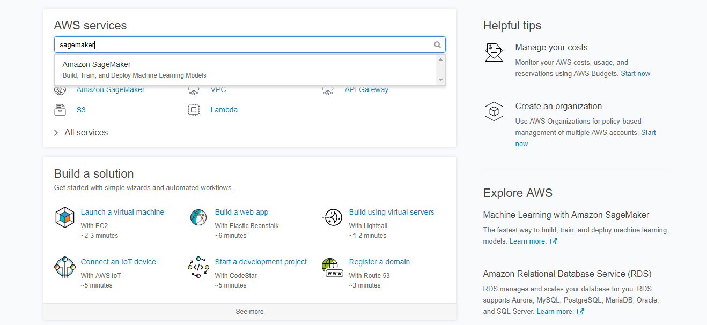
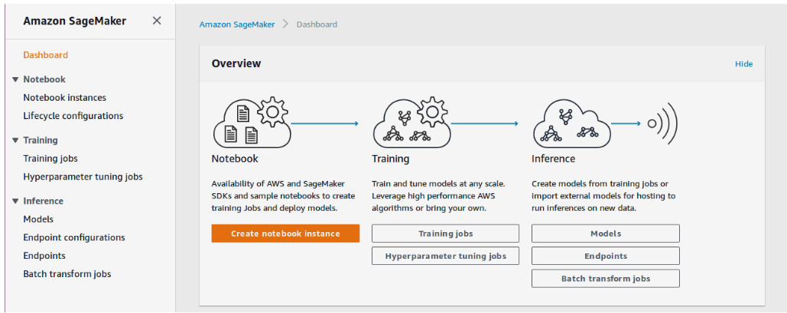
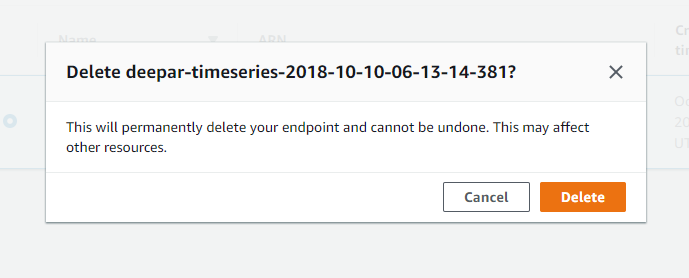
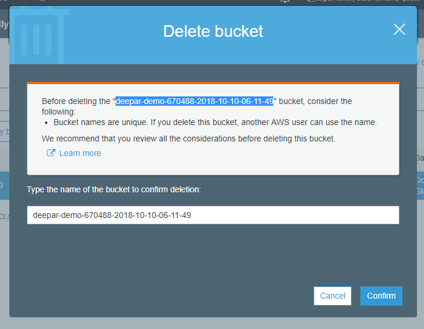

# Cleaning up of resources
In the process of learning the DeepAR implementation, we have created some resources that need to be stopped/deleted as they are billable and will continue to cost you untill stopped/deleted.

We have already deleted the endpoint during the session, but just to be sure, 
Go to [https://aws.amazon.com/](https://aws.amazon.com/) and sign-in into your account.

Next, at the home console screen, type in "SageMaker" into the search bar and select "Amazon SageMaker":

Next, you should find yourself at the Amazon SageMaker home page.

Here, click on **Endpoints** under the *Inference* section. 
You, will be directed to the page that displays all the endpoints that you have created.
Here, select the endpoint and under actions, select delete to delete the endpoint.

  </img>

Now, we will stop the notebook instance. So go to the **Notebook instances** under the *Notebook* section.

Click **Stop** to stop the notebook instance and in a while the Status will change to *Stopped*. You have a choice to start the instance and go to Open and start using the notebook again.

Incase if you don't want to use the notebook again, you can delete the notebook. Select the notebook and under Actions select delete to remove the instance.

  </img>

The next step will be to delete the S3 bucket that was created during hands-on session. This is an optional step.
Go to S3 from under resources.

Here search for the bucket that you have created. Select the bucket and you will get the delete bucket option.

The S3 bucket is deleted and all the resources that we have created in our hands-on lab have been cleaned.
