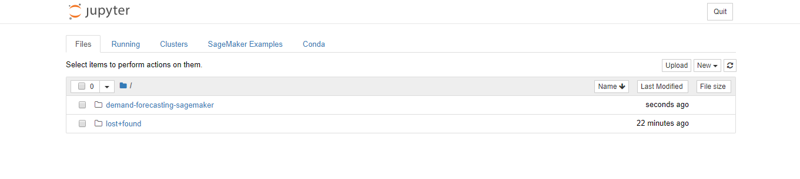

### Launching a SageMaker Notebook Instance

Go to [https://aws.amazon.com/](https://aws.amazon.com/) and sign-in into your account.

Next, at the home console screen, type "SageMaker" into the search bar and select "Amazon SageMaker" making sure you are in the 'Northern Virginia' Region:


Next, you should find yourself at the Amazon SageMaker home page.
If you come accross such a page, select "US East 1 (N. Virginia)" from the drop-down menu.


And you will be redirected to the SageMaker page.


Click on the "create notebook instance" box and go to that page.


Add the notebook instance name. And use the following configurations:<br>
* For this example we are going to use the ml.t2.medium instance type. For more details about the instance, [go here](https://aws.amazon.com/sagemaker/pricing/instance-types/).<br>
* Keep the IAM role as mentioned. Do not make any changes to it. It creates the role that SageMaker uses for it’s execution.<br>
* In this example we do not configure a VPC. Note that this notebook can be launched in a custom VPC’s.<br>
* Lifecycle Configuration is the script that will run when the instance is initiated or when an existing instance is started again. We keep it blank for this example.<br>
* We are not using any custom encryption key for this example.<br>
* Adding tags is optional. Here we are adding a description in the tags.<br>
&nbsp;&nbsp;&nbsp;&nbsp;&nbsp;&nbsp;Key : Description<br>
&nbsp;&nbsp;&nbsp;&nbsp;&nbsp;&nbsp;Value : Sagemaker instance to learn timeseries at re:Invent.

And then hit create notebook instance to launch the instance. This may take about 2-5 minutes.


Once the Status is InService, under Actions select "Open" and you will be redirected to the jupyter notebook.


Now, click on "new" box and select the terminal option to open a new terminal tab.


You, will get the screen below.


Here, type the following commands to clone the github repository for the workshop.<br>
```shell
cd SageMaker/
git clone https://github.com/nikhil031294/ProspectingDay2020.git
```


Once this is done, close the tab and come back to the jupyter notebook page. You will see a new folder "demand-forecasting-sagemaker". The code for the entire workshop resides in that folder.



Congratulations! You've now completed the Sagemaker NoteBook Setup

Now, open the demand-forecasting-sagemaker folder and you will see the following files and folders.


In this directory, go to the DeepAR-demo folder and click on the DeepAR-lab.ipynb file.


Next Step is the DeepAR hands-on lab. To continue, [go here](../DeepAR-demo/DeepAR-Lab.ipynb)
